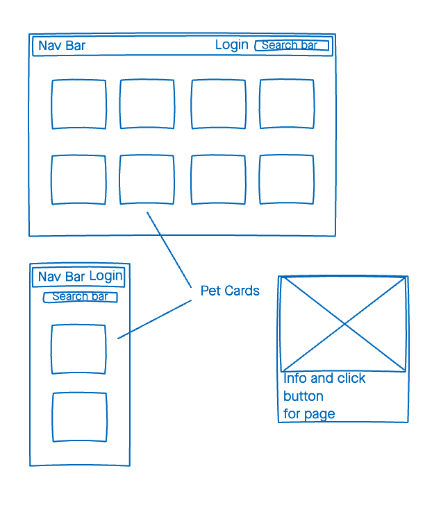
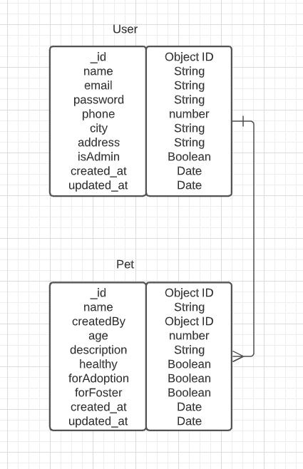
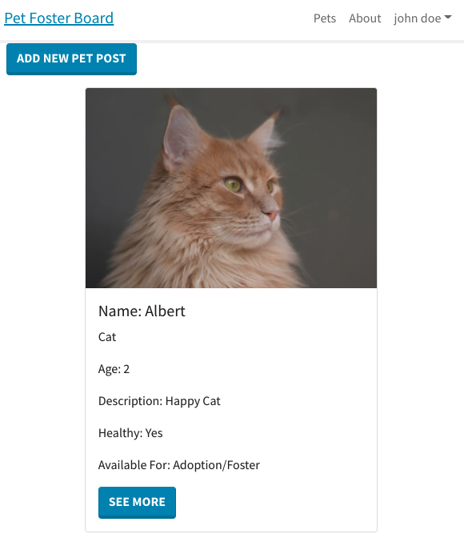
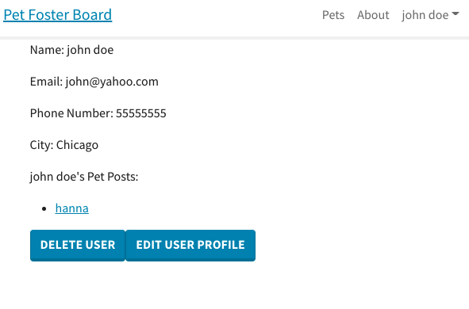

# Pet Foster Board

A web site dedicated to pet adoption/fostering where users can login and post/contact others about pet information

## Technologies

- HTML
- CSS
- [React-Bootstrap](https://react-bootstrap.netlify.app/)
- JavaScript/jQuery
- [React](https://reactjs.org/)
- MongoDB
- Node.js
- Express
- [JSON Web Tokens](https://jwt.io/)
- [Bcrypt](https://www.npmjs.com/package/bcrypt)

## Screenshots

### Wireframes

### ERD

### Images of App

## Getting Started

Click [here](https://pet-dashboard-frontend.herokuapp.com/) to visit working App

## Future Enhancements

- More Route protection using JWT
- More user functionality
- Adding more styling
